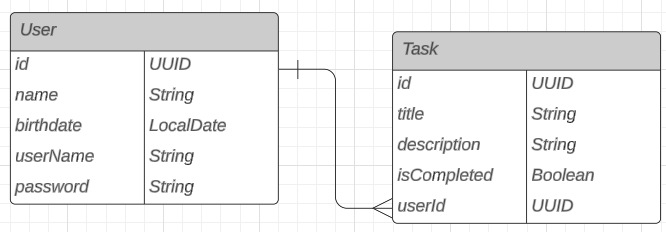

# Proyecto de una API de tareas
Este proyecto se realiza con el fin de aprendizaje del lenguaje Java con Spring Boot.

En este proyecto se realiza la creación de una API RESTful para administrar una lista de tareas. Permite operaciones CRUD (Create, Read, Update, Delete) en las tareas.

## Documentación de la API
